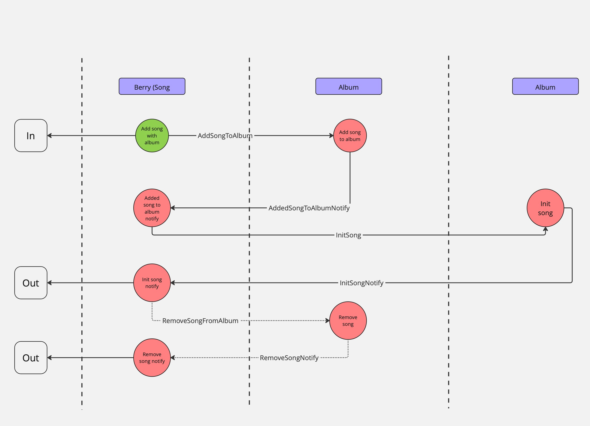

# Contract documentation

This is the documentation for the contract.

## Public actions
- [Add song](#add-song)

### Add song
Add a song to the system. If album set, the song will be added to the album.

### Constants
- `FeeForAddSong = ton("0.01)` - Fee for adding a song (donation)
- `TonForStorageSong = ton("0.2")` - TON for storing a song
- `TonForStorageAlbum = ton("0.2")` - TON for storing an album
- `MaxSongTitleBytes = 800` - Maximum bytes for song title

#### Require
- Min fee is `FeeForAddSong + TonForStorageSong + TonForStorageAlbum + ton("0.5")`
- Song and album title cannot be empty
- Song and title cannot be more than `MaxSongTitleBytes` bytes

#### Message
```tact
message AddSong {
    songTitle: String;      // Title of the song
    albumTitle: String?;    // Title of the album. Optional because a song can be added without an album
}
```
#### Schema
